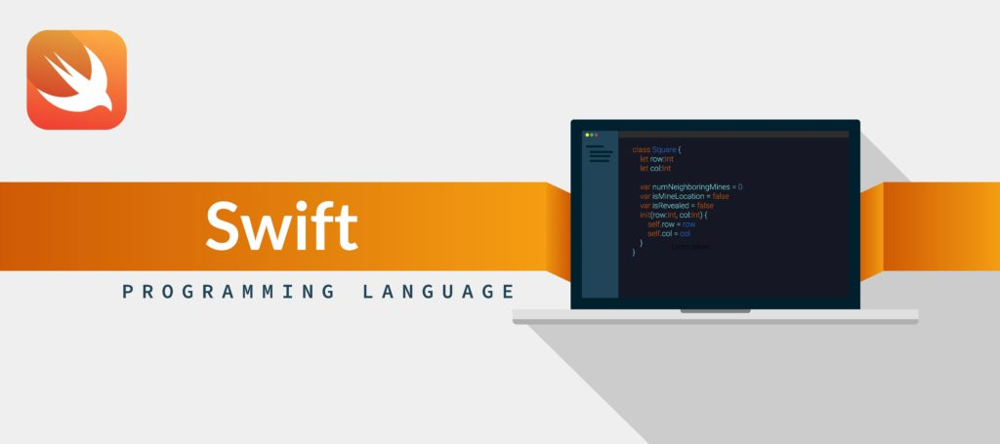

# Introduction to Swift Programming Language

> I have never used a mac book  at the the time of writing this document but I did get to practice swift programming language using windows code runner which runs and compile  swift code and gives you the resulting value

The Swift Programming Language is the authoritative reference for Swift, offering a guided tour, a comprehensive guide, and a formal reference of the language. [swift.org](https://swift.org/documentation/#the-swift-programming-language).

Swift is a fantastic way to write software, whether it’s for phones, desktops, servers, or anything else that runs code. It’s a safe, fast, and interactive programming language that combines the best in modern language thinking with wisdom from the wider Apple engineering culture and the diverse contributions from its open-source community. The compiler is optimized for performance and the language is optimized for development, without compromising on either. Swift is friendly to new programmers. It’s an industrial-quality programming language that’s as expressive and enjoyable as a scripting language. 

Swift defines away large classes of common programming errors by adopting modern programming patterns:

- Variables are always initialized before use.
- Array indices are checked for out-of-bounds errors.
- Integers are checked for overflow.
- Optionals ensure that nil values are handled explicitly.
- Memory is managed automatically.
- Error handling allows controlled recovery from unexpected failures.

With complie time optimization to get the most from a modern hardware ,  The syntax and standard library were designed based on the core guiding principle that the obvious way to write your code should also perform the best.

> Swift combines powerful type inference and pattern matching with a modern, lightweight syntax, allowing complex ideas to be expressed in a clear and concise manner

